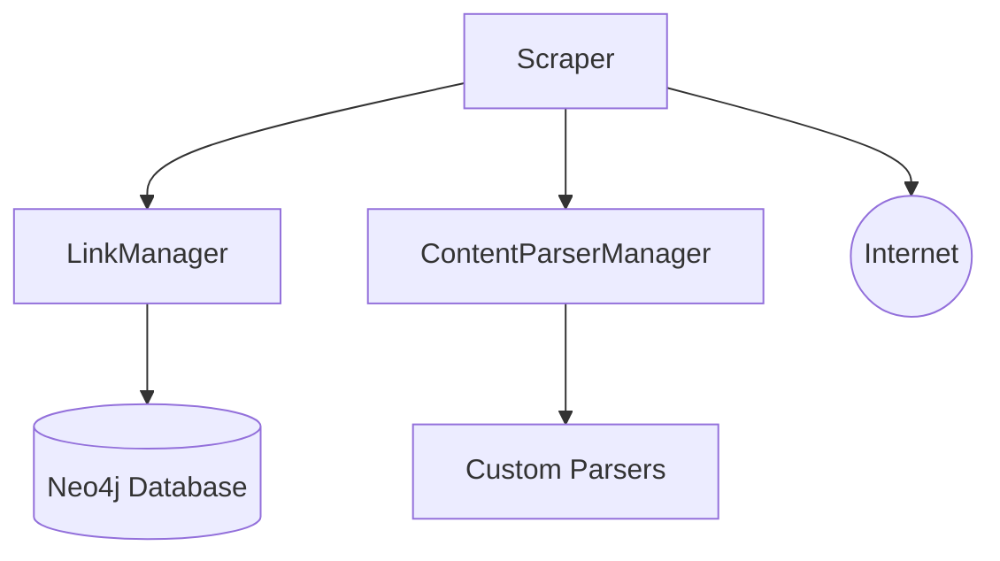
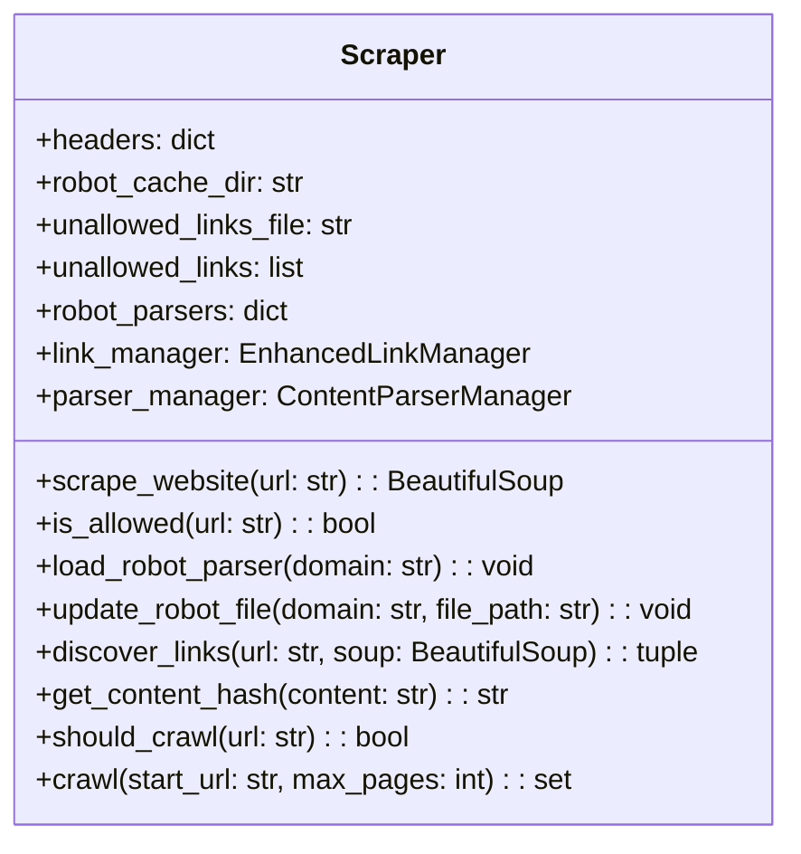
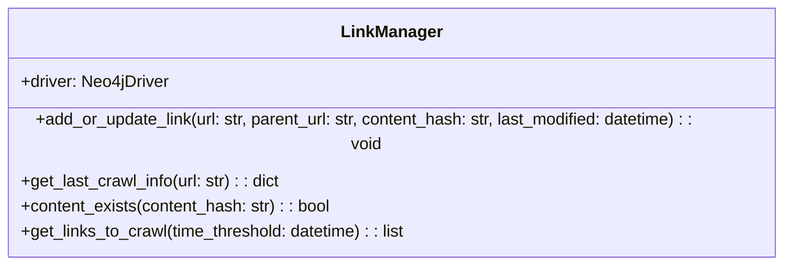
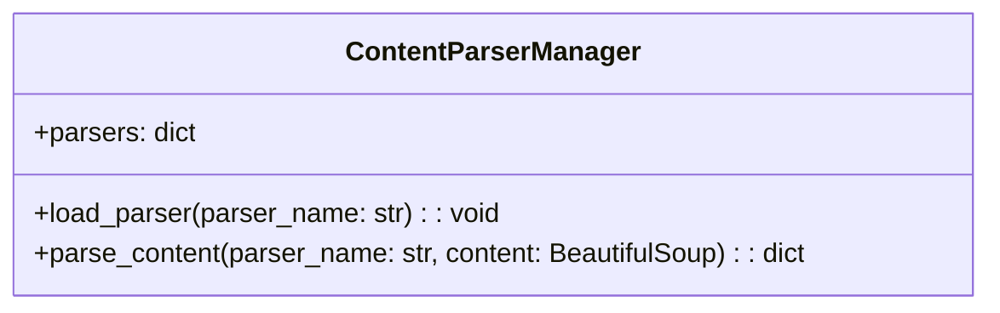
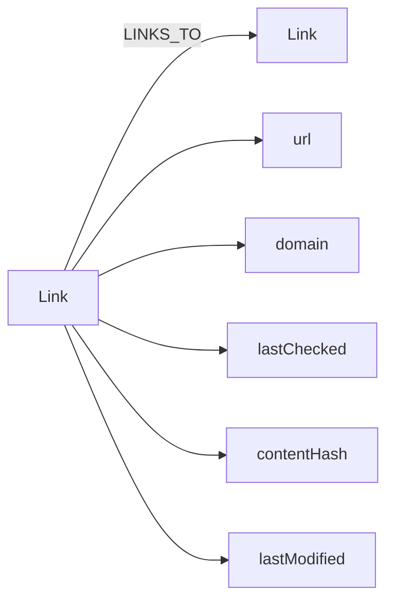

# Web Crawler Software Definition Document

## 1. Introduction

### 1.1 Purpose
This Software Definition Document (SDD) outlines the design and implementation details of a web crawler system. The system is designed to efficiently crawl websites, store link information, and provide a flexible framework for content parsing.

### 1.2 Scope
The web crawler system includes:
- Asynchronous web scraping functionality
- Link management using a Neo4j database
- Flexible content parsing system
- Politeness features including rate limiting and robots.txt compliance
- Incremental crawling capabilities
- Content deduplication

### 1.3 Definitions, Acronyms, and Abbreviations
- SDD: Software Definition Document
- API: Application Programming Interface
- URL: Uniform Resource Locator
- HTML: Hypertext Markup Language
- HTTP: Hypertext Transfer Protocol
- Neo4j: A graph database management system

## 2. System Overview

The web crawler system is designed to efficiently crawl websites, extract information, and store link relationships. It consists of two main components:

1. Scraper: Handles the crawling logic, including fetching web pages, parsing HTML, and discovering links.
2. LinkManager: Manages link information storage and retrieval using a Neo4j database.

The system also includes a ContentParserManager that allows for flexible content parsing based on the needs of the data science team.

## 3. System Architecture

### 3.1 Component Diagram

### 3.2 Component Descriptions

#### 3.2.1 Scraper
The Scraper is responsible for:
- Asynchronously fetching web pages
- Parsing HTML content
- Discovering internal and external links
- Managing the crawling process
- Implementing politeness features (rate limiting, robots.txt compliance)
- Content deduplication

#### 3.2.2 LinkManager
The LinkManager handles:
- Storing and retrieving link information in the Neo4j database
- Managing relationships between links
- Tracking crawl history and content hashes

#### 3.2.3 ContentParserManager
The ContentParserManager provides:
- A plugin system for content parsing
- Dynamic loading of custom parsers
- Flexible content extraction based on specific needs

#### 3.2.4 Neo4j Database
The Neo4j database is used to store:
- Link information (URL, domain, last checked date, content hash)
- Relationships between links (e.g., parent-child relationships)

## 4. Detailed System Design

### 4.1 Scraper

#### 4.1.1 Class Diagram

#### 4.1.2 Key Methods

- `scrape_website(url)`: Asynchronously fetches and parses a web page.
- `is_allowed(url)`: Checks if crawling a URL is allowed based on robots.txt rules.
- `discover_links(url, soup)`: Extracts internal, external, and resource links from a parsed web page.
- `crawl(start_url, max_pages)`: Manages the crawling process, starting from a given URL.

### 4.2 LinkManager

#### 4.2.1 Class Diagram

#### 4.2.2 Key Methods

- `add_or_update_link(url, parent_url, content_hash, last_modified)`: Adds or updates a link in the database.
- `get_last_crawl_info(url)`: Retrieves the last crawl information for a given URL.
- `content_exists(content_hash)`: Checks if content with a given hash exists in the database.
- `get_links_to_crawl(time_threshold)`: Retrieves links that need to be crawled based on a time threshold.

### 4.3 ContentParserManager

#### 4.3.1 Class Diagram

#### 4.3.2 Key Methods

- `load_parser(parser_name)`: Dynamically loads a parser module.
- `parse_content(parser_name, content)`: Parses content using the specified parser.

## 5. Data Design

### 5.1 Neo4j Data Model

### 5.2 Key Entities

- Link: Represents a web page with properties such as URL, domain, last checked date, content hash, and last modified date.
- LINKS_TO: Represents the relationship between two links (pages).

## 6. Interface Design

### 6.1 User Interface
The web crawler is a backend system and does not have a user interface. Interaction with the system is done through the command-line interface or by integrating it into other applications.

### 6.2 API
The system does not expose an external API. However, the main components (Scraper, LinkManager, and ContentParserManager) can be used as internal APIs for integration with other parts of the system or external applications.

## 7. Error Handling and Logging

- The system uses Python's logging module to log information, warnings, and errors.
- Retry mechanisms are implemented for handling transient network errors.
- Exceptions are caught and logged appropriately throughout the system.

## 8. Performance Considerations

- Asynchronous programming is used to improve crawling performance.
- Rate limiting is implemented to ensure politeness and avoid overwhelming target servers.
- Content deduplication reduces unnecessary storage and processing.
- Incremental crawling minimizes redundant crawling of unchanged content.

## 9. Security Considerations

- The system respects robots.txt files and implements rate limiting to avoid being perceived as a malicious bot.
- Secure connections (HTTPS) are used when available.
- Database credentials are stored securely and not hard-coded in the source files.

## 10. Testing Strategy

- Unit tests should be implemented for individual components (AsyncScraper, EnhancedLinkManager, ContentParserManager).
- Integration tests should be created to ensure proper interaction between components.
- Stress tests should be performed to evaluate system performance under high load.

## 11. Deployment and Maintenance

### 11.1 Dependencies
- Python 3.7+
- aiohttp
- beautifulsoup4
- neo4j
- ratelimit
- tenacity

### 11.2 Deployment Steps
1. Set up a Neo4j database instance.
2. Install required Python packages.
3. Configure database connection details in the EnhancedLinkManager.
4. Implement custom parsers as needed in the `parsers` directory.
5. Run the main script to start the crawling process.

### 11.3 Maintenance
- Regularly update dependencies to ensure security and performance improvements.
- Monitor system logs for errors and unexpected behavior.
- Periodically review and optimize database queries and indexes.

## 12. Enhancements

- Implement distributed crawling using message queues (e.g., RabbitMQ, Apache Kafka).
- Add support for sitemaps to improve crawling efficiency.
- Enhance content parsing capabilities with machine learning techniques.

## 13. Conclusion

This Software Definition Document provides a comprehensive overview of the web crawler system, including its architecture, components, and key functionalities. 