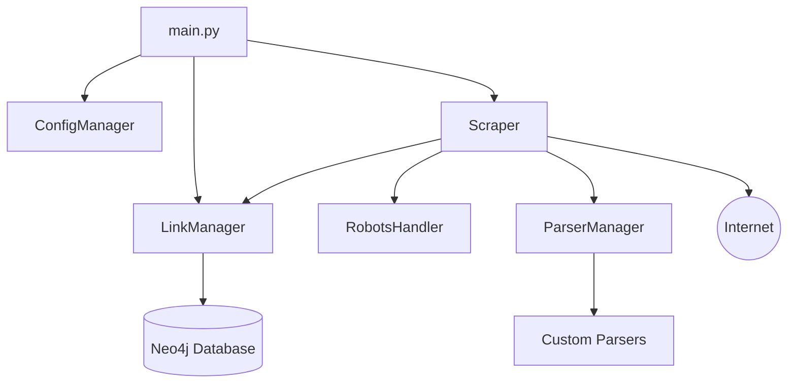
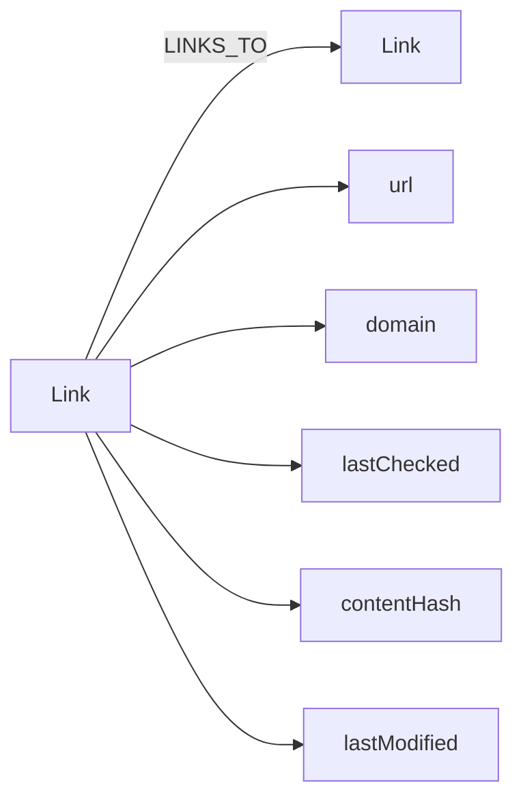

# Web Crawler Software Definition Document

## 1. Introduction

### 1.1 Purpose
This Software Definition Document (SDD) outlines the design and implementation details of a web crawler system. The system is designed to efficiently crawl websites, store link information, and provide a flexible framework for content parsing.

### 1.2 Scope
The web crawler system includes:
- Asynchronous web scraping functionality
- Link management using a Neo4j database
- Flexible content parsing system
- Politeness features including rate limiting and robots.txt compliance
- Incremental crawling capabilities
- Content deduplication

### 1.3 Definitions, Acronyms, and Abbreviations
- SDD: Software Definition Document
- API: Application Programming Interface
- URL: Uniform Resource Locator
- HTML: Hypertext Markup Language
- HTTP: Hypertext Transfer Protocol
- Neo4j: A graph database management system

## 2. System Overview

The web crawler system is designed to efficiently crawl websites, extract information, and store link relationships. It consists of several main components:

1. Scraper: Handles the crawling logic, including fetching web pages, parsing HTML, and discovering links.
2. LinkManager: Manages link information storage and retrieval using a Neo4j database.
3. ConfigManager: Manages configuration settings for the system.
4. RobotsHandler: Handles robots.txt parsing and crawling permissions.
5. ParserManager: Manages content parsing with support for custom parsers.

## 3. System Architecture

### 3.1 Component Diagram

### 3.2 Component Descriptions

#### 3.2.1 main.py
The entry point of the application, responsible for initializing components and starting the crawl process.

#### 3.2.2 ConfigManager
Manages configuration settings loaded from a YAML file.

#### 3.2.3 Scraper
The Scraper is responsible for:
- Asynchronously fetching web pages
- Parsing HTML content
- Discovering internal and external links
- Managing the crawling process
- Implementing politeness features (rate limiting, robots.txt compliance)
- Content deduplication

#### 3.2.4 LinkManager
The LinkManager handles:
- Storing and retrieving link information in the Neo4j database
- Managing relationships between links
- Tracking crawl history and content hashes

#### 3.2.5 RobotsHandler
Manages the fetching, parsing, and caching of robots.txt files, ensuring crawler politeness.

#### 3.2.6 ParserManager
Manages content parsing, including loading and using custom parsers.

#### 3.2.7 Neo4j Database
The Neo4j database is used to store:
- Link information (URL, domain, last checked date, content hash)
- Relationships between links (e.g., parent-child relationships)

## 4. Data Design

### 4.1 Neo4j Data Model

### 4.2 Key Entities

- Link: Represents a web page with properties such as URL, domain, last checked date, content hash, and last modified date.
- LINKS_TO: Represents the relationship between two links (pages).

## 5. Error Handling and Logging

- The system uses Python's logging module to log information, warnings, and errors.
- Retry mechanisms are implemented for handling transient network errors.
- Exceptions are caught and logged appropriately throughout the system.

## 6. Performance Considerations

- Asynchronous programming is used to improve crawling performance.
- Rate limiting is implemented to ensure politeness and avoid overwhelming target servers.
- Content deduplication reduces unnecessary storage and processing.
- Incremental crawling minimizes redundant crawling of unchanged content.

## 7. Security Considerations

- The system respects robots.txt files and implements rate limiting to avoid being perceived as a malicious bot.
- Configuration settings, including database credentials, are stored in a separate YAML file, improving security and maintainability.

## 8. Deployment

### 8.1 Deployment Steps
1. Set up a Neo4j database instance.
2. Install required Python packages: `pip install -r requirements.txt`
3. Configure settings in `config.yaml`, including database connection details.
4. Run the main script to start the crawling process: `python main.py`
